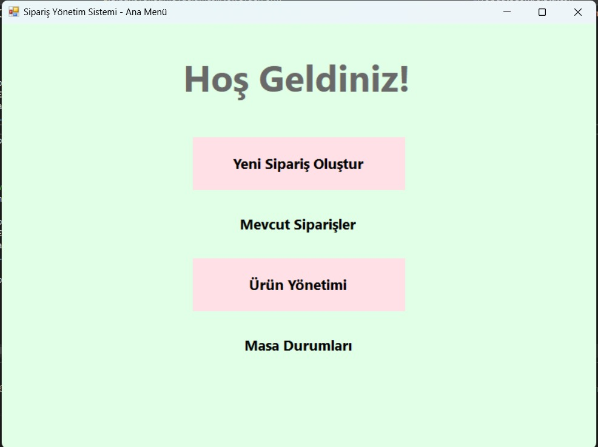
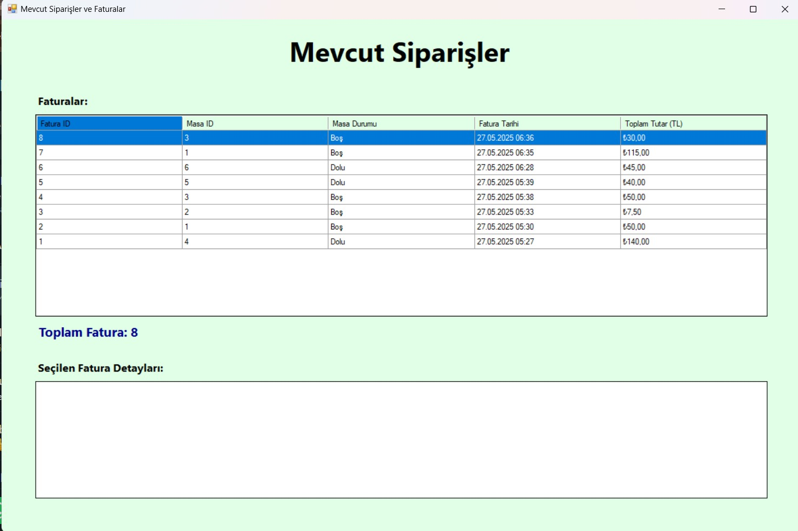
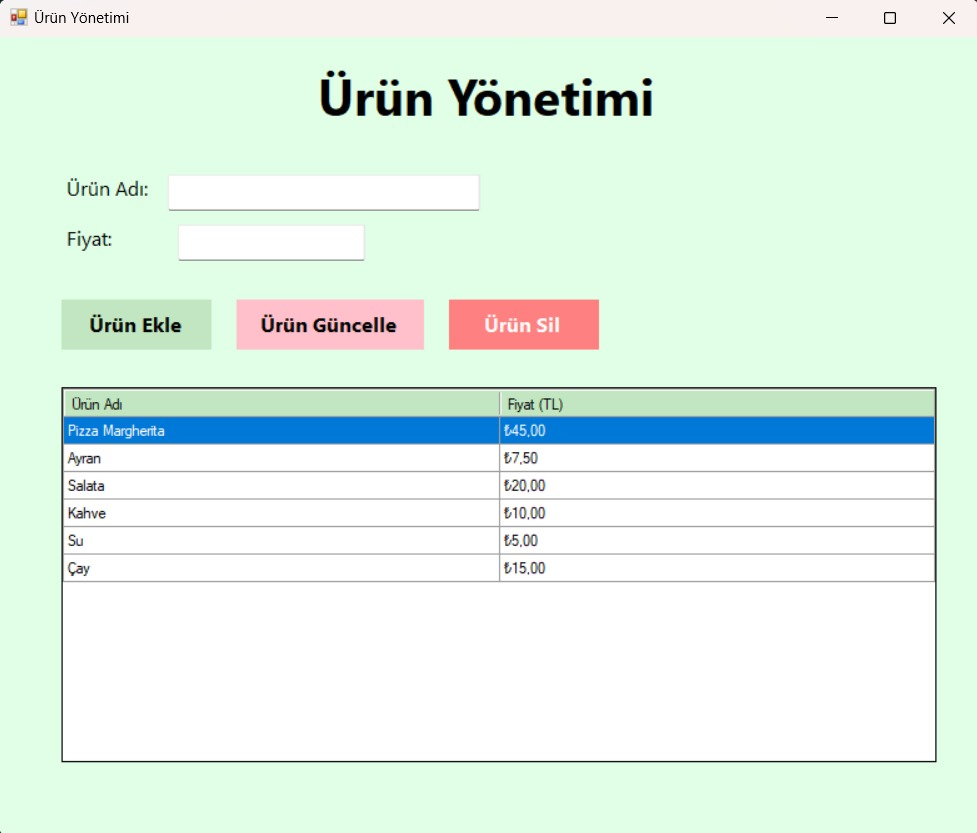
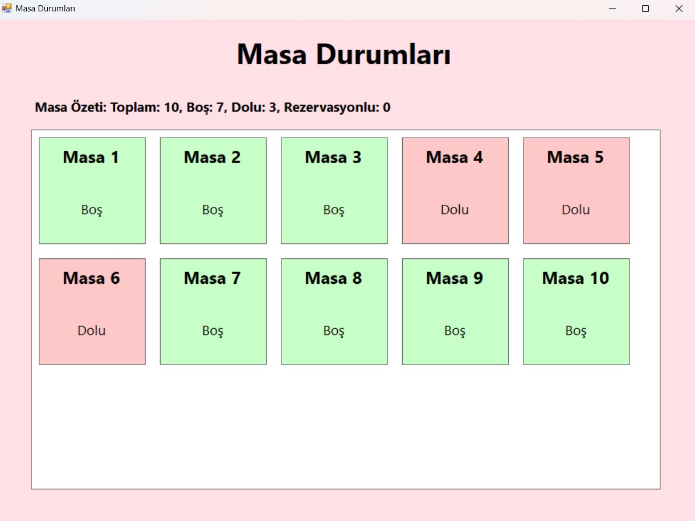

# Sipariş Yönetim Sistemi 🧾

Bu proje, restoran veya kafe gibi işletmeler için geliştirilen basit ve kullanıcı dostu bir **sipariş-fatura yönetim sistemidir**. Masa yönetimi, ürün kontrolü ve fatura işlemleri tek ekranda kolaylıkla gerçekleştirilebilir.

---

## 📌 Ana Özellikler

- ✅ Yeni sipariş oluşturma
- ✅ Ürün ekleme, güncelleme ve silme
- ✅ Masa durumu takibi (Boş / Dolu)
- ✅ Fatura görüntüleme ve detayları
- ✅ Toplam tutar hesaplama

---

## 🖼️ Ekran Görüntüleri

### 🔹 Ana Menü

### 🔹 Yeni Sipariş Oluşturma

### 🔹 Mevcut Siparişler ve Faturalar

### 🔹 Ürün Yönetimi

### 🔹 Masa Durumları

---

## 🛠️ Kullanılan Teknolojiler

- Python
- Tkinter (GUI Arayüzü)
- SQLite (Veritabanı)

---

## 👨‍💻 Geliştirici

> Bu proje bireysel geliştirme amaçlıdır. Daha gelişmiş versiyonlar için issue açabilir ya da katkıda bulunabilirsin.  
📩 Her türlü öneri ve geri bildirime açığım.

---

## ⚠️ Not

> Ekran görüntülerini `/screenshots/` klasörüne koymayı unutma. Yoksa görseller görünmez.
